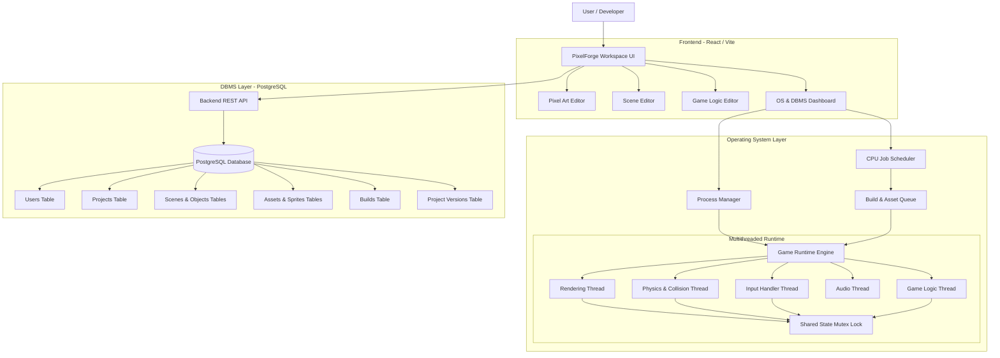

# PixelForge

> A 2D Pixel-Art Game Development and Runtime Ecosystem

PixelForge is a game development tool that allows users to create pixel art, sprites, animations, scenes, and game logic, and run them inside a built-in game engine.

The platform is designed to make game creation simple while demonstrating how core Computer Science concepts from Operating Systems (OS) and Database Management Systems (DBMS) operate in a real-world software system.

---

## Table of Contents

- [Overview](#overview)
- [System Architecture](#system-architecture)
- [User Workspace Layout](#user-workspace-layout)
- [Core Features](#core-features)
- [Operating System Concepts and Where They Are Used](#operating-system-concepts-and-where-they-are-used)
- [DBMS Concepts and Where They Are Used](#dbms-concepts-and-where-they-are-used)
- [End-to-End Workflow Example](#end-to-end-workflow-example)
- [Technology Stack](#technology-stack)
- [Project Structure](#project-structure)
- [Installation and Setup](#installation-and-setup)
- [Project Scope and Future Roadmap](#project-scope-and-future-roadmap)
- [License](#license)

---

## Overview

PixelForge brings all parts of 2D game development into one screen:
- Draw pixel art and create sprite sheets.
- Build frame-by-frame character animations.
- Design tile-based levels with collision bounds.
- Add gameplay rules using trigger-action events.
- Run and play the game instantly in the browser.
- Track runtime processes and database transactions in a developer dashboard.

---

## System Architecture



---

## User Workspace Layout

The editor interface consists of five main panels:

```
+-----------------------------------------------------------------------------------------------+
|  PIXELFORGE                                       [Run] [Stop] [Build] [Save Project]         |
+-------------------+-------------------------------------------------------+-------------------+
|  ASSET MANAGER    |  SCENE VIEWPORT / CANVAS                              |  INSPECTOR        |
|  - Sprites        |  +-------------------------------------------------+  |  Transform:       |
|    - player_idle  |  | [Grid: 16x16] [Snap: ON]                        |  |    X: 128  Y: 64  |
|    - enemy_walk   |  |                                                 |  |  Collider:        |
|  - Tilesets       |  |        (Player)                                 |  |    Type: Box      |
|    - dungeon_set  |  |          [P]          (Coin)                    |  |    Solid: YES     |
|  - Audio          |  |       [======]         ( $ )                    |  |  Properties:      |
|    - jump.wav     |  |   ============================= [Door]          |  |    Tag: Player    |
|    - coin.wav     |  |   ############################# [====]          |  |    Health: 100    |
+-------------------+-------------------------------------------------------+-------------------+
|  TIMELINE / ANIMATION FRAMES & GAME LOGIC RULES                                               |
|  [Frame 1] [Frame 2] [Frame 3] [Frame 4]  |  FPS: 10 | Loop: ON                               |
|  EVENT: On Player Touches Coin -> ACTION: Increase Score by 10 -> Destroy Coin                |
+-----------------------------------------------------------------------------------------------+
```

---

## Core Features

- **Pixel Art Editor**: Draw sprites with pencil, eraser, color fill, shapes, palette controls, and layers.
- **Sprite Manager**: Import, crop, tag, slice, and organize sprite sheets and individual assets.
- **Animation Editor**: Create frame sequences with customizable frame rates (FPS), loop controls, and state tags (Idle, Run, Jump, Attack).
- **Scene Editor**: Construct multi-layer tile maps with background, collision, and foreground layers.
- **Game Logic System**: Set up gameplay rules using visual trigger-action blocks (for example, collision events, key presses, timers).
- **Build Manager**: Package game code, sprite sheets, and audio assets into playable bundles with error logging.
- **Game Runtime**: 60 FPS HTML5 Canvas engine with sprite rendering, AABB collision detection, and input handling.

---

## Operating System Concepts and Where They Are Used

PixelForge uses practical Operating System concepts to manage execution, tasks, and system resources:

### 1. Process Management
- **Where it is used**: Managing editor background tasks and game execution.
- **How it works**: Every major operation (Game Runtime, Asset Loader, Build Generator, Project Exporter) is treated as an independent process.
- **Attributes tracked**: Process ID (PID), Process Name, Current State (Ready, Running, Waiting, Terminated), and Priority Level.
- **Process Table Example**:

| PID | Process Name | State | Priority | Purpose |
| :--- | :--- | :--- | :--- | :--- |
| 101 | Game Runtime | Running | High | Executes the active game loop |
| 102 | Asset Loader | Waiting | Medium | Loads and decodes image and audio files |
| 103 | Build Packager | Ready | Low | Bundles game assets and scripts in background |

### 2. CPU Scheduling Algorithms
- **Where it is used**: The Build and Export task queue.
- **How it works**: When multiple jobs are requested (e.g. Build Game, Compress Assets, Export Sprite Sheet, Generate Version Backup), they enter the Ready Queue. Users can compare how different CPU scheduling algorithms handle these jobs:
  - **First-Come, First-Served (FCFS)**: Jobs run in exact order of arrival.
  - **Round Robin (RR)**: Each job receives a fixed time slice (quantum). If unfinished, it is paused and placed at the back of the queue.
  - **Priority Scheduling**: Urgent jobs (like running a playtest build) run before lower-priority background tasks.
- **Metrics shown**: Turnaround Time, Waiting Time, and Context Switch count.

### 3. Multithreading
- **Where it is used**: Inside the Game Runtime engine.
- **How it works**: To keep the game running at a smooth 60 FPS without UI freezes, runtime operations run in separate dedicated threads:
  - **Rendering Thread**: Draws sprites, tilemaps, and UI elements to the canvas.
  - **Physics & Collision Thread**: Calculates entity positions, gravity, velocity, and box collisions.
  - **Input Thread**: Listens to keyboard, mouse, and touch events without blocking frames.
  - **Audio Thread**: Plays background music and sound effects.
  - **Game Logic Thread**: Evaluates event rules and scripts.

### 4. Concurrency and Synchronization (Mutex Locks)
- **Where it is used**: Shared game state access between threads.
- **How it works**: The Physics Thread updates an object's position (X, Y) while the Rendering Thread reads the same position to draw it.
- **Synchronization Method**: A Mutex (Mutual Exclusion) lock protects the shared game state to avoid race conditions and visual glitches:
  ```
  [Physics Thread]  -> ACQUIRE LOCK -> Update Player Position -> RELEASE LOCK
  [Render Thread]   -> ACQUIRE LOCK -> Read Player Position   -> RELEASE LOCK -> Draw Frame
  ```

### 5. File System Organization
- **Where it is used**: Structured storage of game project assets.
- **How it works**: PixelForge creates a clear, modular folder structure for each game:
  - `/sprites` for raw and sliced images.
  - `/animations` for frame timing data.
  - `/scenes` for tile maps and object placements.
  - `/scripts` for logic rules.
  - `/audio` for sound files.
  - `/builds` for packaged output files.

### 6. Inter-Process Communication (IPC) and Resource Management
- **Where it is used**: Communication between the UI workspace and the runtime engine.
- **How it works**: Structured messages send play, pause, stop, and hot-reload commands to the runtime.
- **Resource Monitoring**: The dashboard monitors CPU usage, memory consumption, and frame time budgets (16.6ms per frame).

---

## DBMS Concepts and Where They Are Used

PixelForge uses PostgreSQL to store all project data, assets, scenes, and historical versions safely.

### 1. Relational Data Modeling and Schema Design
- **Where it is used**: Storing structured game components in relational tables.
- **How it works**: Data is broken down into normalized tables with clear relationships:

```
Users (1) ---> (Many) Projects (1) ---> (Many) Scenes (1) ---> (Many) Game Objects
                           │
                           ├──-> (Many) Assets ---> Sprites / Animations / Audio
                           ├──-> (Many) Scripts
                           ├──-> (Many) Builds
                           └──-> (Many) Project Versions
```

### 2. Database Tables Summary

| Table Name | Description | Key Columns |
| :--- | :--- | :--- |
| `users` | User accounts and credentials | `id`, `username`, `email`, `password_hash`, `created_at` |
| `projects` | Game project settings and canvas dimensions | `id`, `user_id`, `title`, `width`, `height`, `created_at` |
| `scenes` | Level layouts and tile data | `id`, `project_id`, `name`, `order_index`, `tile_data` |
| `game_objects` | Placed items, enemies, and obstacles in scenes | `id`, `scene_id`, `name`, `x`, `y`, `scale`, `components` |
| `assets` | General metadata for uploaded and created media | `id`, `project_id`, `name`, `type`, `file_path` |
| `sprites` | Pixel dimensions and pivot points of sprites | `id`, `asset_id`, `width`, `height`, `pivot_x`, `pivot_y` |
| `animations` | Animation sequences and frame playback speed | `id`, `project_id`, `name`, `fps`, `frames_json` |
| `scripts` | Game logic triggers and action rules | `id`, `project_id`, `name`, `trigger_type`, `action_payload` |
| `builds` | Build history, compilation status, and logs | `id`, `project_id`, `version_id`, `status`, `build_size` |
| `project_versions` | Full project snapshots for recovery | `id`, `project_id`, `version_num`, `snapshot_data`, `created_at` |

### 3. Primary Keys, Foreign Keys, and Referential Integrity
- **Where it is used**: Maintaining clean parent-child relationships.
- **How it works**: `user_id` in `projects` references `users(id)`. `project_id` in `scenes` references `projects(id)`. Cascade deletes (`ON DELETE CASCADE`) ensure that deleting a project automatically cleans up all associated scenes, objects, assets, and scripts.

### 4. ACID Transactions and Atomic Saves
- **Where it is used**: Saving a project with multiple modified scenes, objects, and assets.
- **How it works**: Saving is wrapped in a single database transaction. If any part of the save fails (e.g. invalid scene JSON or lost connection), the entire operation rolls back to keep project data safe:
  ```sql
  BEGIN TRANSACTION;
    UPDATE projects SET updated_at = NOW() WHERE id = 1;
    INSERT INTO scenes (project_id, name, tile_data) VALUES (1, 'Level 1', '{...}');
    INSERT INTO game_objects (scene_id, name, x, y) VALUES (1, 'Player', 10, 20);
    INSERT INTO project_versions (project_id, version_num, snapshot_data) VALUES (1, 'v1.0.1', '{...}');
  COMMIT;
  -- If an error occurs: ROLLBACK;
  ```

### 5. Database Indexing
- **Where it is used**: Speeding up search and data loading for large projects.
- **How it works**: B-Tree indexes allow instant retrieval of assets and scenes:
  - `CREATE INDEX idx_projects_user ON projects(user_id);`
  - `CREATE INDEX idx_scenes_project ON scenes(project_id);`
  - `CREATE INDEX idx_assets_type ON assets(project_id, type);`
  - `CREATE INDEX idx_versions_project ON project_versions(project_id, created_at DESC);`

### 6. Project Versioning and Historical Rollback
- **Where it is used**: Creating version checkpoints and restoring previous states.
- **How it works**: Each major save stores an immutable snapshot in `project_versions`. Users can view past versions, compare differences, and restore their game to any previous checkpoint.

---

## End-to-End Workflow Example

Here is a step-by-step example of creating a game called **Pixel Adventure**:

1. **Create Project**: Start a new project with a 320x180 resolution canvas and a 16x16 grid.
2. **Draw Sprites**: Use the pixel editor to draw a hero character, a slime enemy, a coin, and a dungeon tileset.
3. **Build Animations**: Create `hero_idle` (4 frames) and `hero_run` (6 frames) at 10 FPS.
4. **Design Level 1**: Paint ground and platforms using the tile palette, then place the player, enemies, coins, and a level-exit door.
5. **Add Logic Rules**:
   - When Player touches Coin -> Add 10 to Score, play sound `coin.wav`, remove Coin.
   - When Player touches Enemy -> Decrease Health by 1, restart level if Health reaches 0.
   - When Player touches Door -> Load Scene `Level 2`.
6. **Save Project**: Triggers an ACID database transaction to persist all entities and create a version record (`v1.0`).
7. **Build and Run**: The OS scheduler schedules the build job, bundles files, and launches the runtime engine with active multithreaded loops.

---

## Technology Stack

| Layer | Technology | Purpose |
| :--- | :--- | :--- |
| **Frontend** | React.js (Vite) | Main user interface, panels, timeline, and inspector |
| **Styling** | Tailwind CSS | Clean layout and responsive dark-theme design |
| **Canvas & Rendering** | HTML5 Canvas 2D | Pixel drawing tools and real-time game viewport |
| **Backend API** | Python (FastAPI) / Node.js (Express) | REST API for projects, assets, scenes, and builds |
| **Database** | PostgreSQL | Relational storage with ACID transaction guarantees |
| **Data Access** | SQLAlchemy / Prisma | Database schema models and query execution |
| **OS Simulation Module** | C++ / Python / TypeScript | CPU scheduling and multithreading demonstration |
| **Tools & Testing** | Git, Postman, Docker | Source control, API testing, and environment setup |

---

## Project Structure

```
PixelForge/
├── backend/                  # Backend REST API Service
│   ├── app/
│   │   ├── database/         # Database connection and session management
│   │   ├── models/           # Database table models
│   │   ├── routes/           # REST API endpoints (auth, projects, assets)
│   │   ├── schemas/          # Data validation models
│   │   ├── services/         # Build and scheduling business logic
│   │   └── utils/            # Helper utilities and file helpers
│   └── requirements.txt      # Python dependencies
│
├── frontend/                 # Frontend Web Application
│   ├── src/
│   │   ├── components/       # Shared UI components (buttons, modals, sliders)
│   │   ├── editor/           # Pixel canvas, timeline, and scene editor tools
│   │   ├── pages/            # Workspace, dashboard, and version history views
│   │   ├── services/         # API and communication clients
│   │   └── utils/            # Math and collision detection helpers
│   ├── package.json          # Node dependencies
│   └── vite.config.js        # Vite build configuration
│
├── database/                 # Database Scripts
│   ├── schema.sql            # PostgreSQL table definitions
│   ├── seed.sql              # Initial test data
│   └── migrations/           # Database migration files
│
└── docs/                     # Documentation and guides
```

---

## Installation and Setup

### Prerequisites
- Node.js (v18 or higher)
- Python (v3.10 or higher) or Node.js
- PostgreSQL (v14 or higher)
- Git

---

### 1. Database Setup

1. Start your PostgreSQL service:
   ```bash
   # macOS (Homebrew)
   brew services start postgresql@14

   # Linux (systemd)
   sudo systemctl start postgresql
   ```

2. Create the database:
   ```bash
   createdb pixelforge
   ```

3. Run the schema and initial seed data:
   ```bash
   psql -d pixelforge -f database/schema.sql
   psql -d pixelforge -f database/seed.sql
   ```

---

### 2. Backend Setup

1. Open a terminal and navigate to the backend folder:
   ```bash
   cd PixelForge/backend
   ```

2. Create and activate a virtual environment:
   ```bash
   python3 -m venv venv
   source venv/bin/activate    # On Windows: venv\Scripts\activate
   ```

3. Install required packages:
   ```bash
   pip install -r requirements.txt
   ```

4. Run the backend server:
   ```bash
   uvicorn app.main:app --reload --port 8000
   ```

---

### 3. Frontend Setup

1. Open a second terminal and navigate to the frontend folder:
   ```bash
   cd PixelForge/frontend
   ```

2. Install dependencies:
   ```bash
   npm install
   ```

3. Start the development server:
   ```bash
   npm run dev
   ```

4. Open your browser and visit:
   ```
   http://localhost:5173
   ```

---

## Project Scope and Future Roadmap

### Phase 1: Core Ecosystem (Current)
- Pixel art drawing tools and palette management.
- Sprite manager and frame animation editor.
- Scene builder with tile placement and collision areas.
- Visual trigger-action rule builder.
- 2D Canvas runtime engine.
- PostgreSQL database persistence with ACID saves.
- OS process tracking and scheduling dashboard.

### Phase 2: Engine Expansion (Planned)
- Built-in audio editor and chiptune sound generator.
- Advanced rigid body physics.
- Cloud project synchronization.

### Phase 3: Community and Publishing (Planned)
- Community asset and template marketplace.
- Standalone desktop and web exports.
- Collaborative multiplayer playtesting.

> **Note on AI Features**: AI-generated art, code generation, and automated game design are intentionally excluded in the current phase to focus on mastering core Operating Systems and DBMS principles.

---

## License

This project is licensed under the MIT License. See the `LICENSE` file for details.
